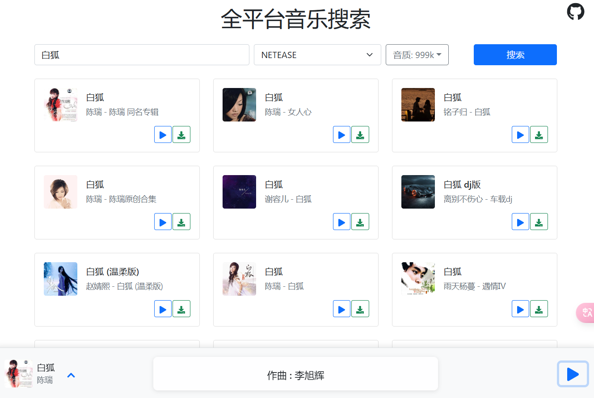
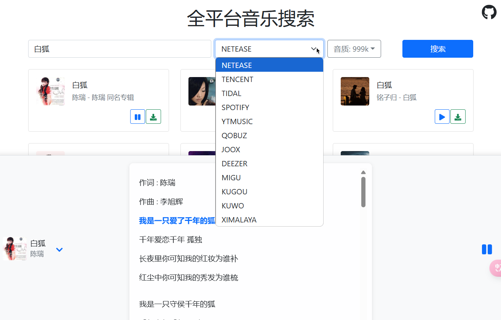
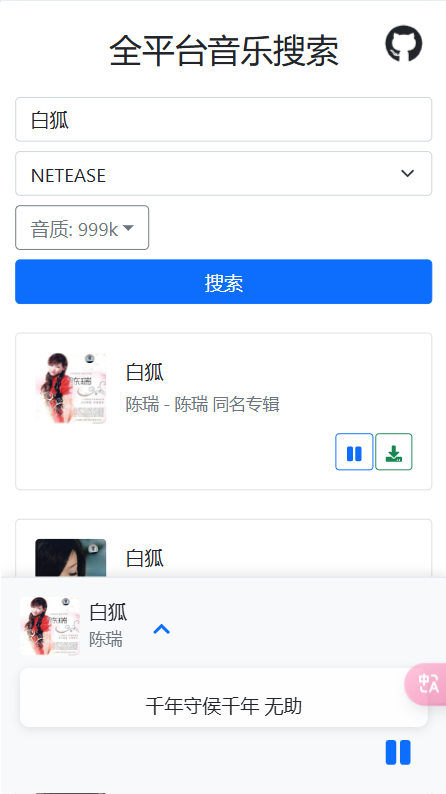

# CL-Music 全平台音乐搜索

一款基于React开发的在线音乐搜索和播放应用。
[](https://app.netlify.com/sites/cl-music/deploys)  [](https://vercel.com)








## 功能特点

- 🎵 支持多平台音乐搜索

  - 网易云音乐
  - QQ音乐
  - TIDAL
  - Spotify
  - YouTube Music
  - Qobuz
  - JOOX
  - Deezer
  - 咪咕音乐
  - 酷狗音乐
  - 酷我音乐
  - 喜马拉雅
- 🎨 主要功能

  - 音乐搜索
  - 在线播放
  - 音乐下载
  - 音质选择(最高支持999k)
  - 歌词显示(支持双语歌词)
  - 专辑封面显示

## 项目部署
 生产环境需配置一个环境编辑，`REACT_APP_API_BASE` 后端API地址，由于跨域问题不可以直接使用，一般填写反代 `https://music-api.gdstudio.xyz/api.php` 后地址，可使用nginx、caddy 等web服务反代，也可是cloudflare worker反代，我这边提供了worker反向代理的代码，见 [worker.js](worker.js)
    可快速部署到 netlify 、vercel、Cloudflare Pages 等平台。[](https://vercel.com/new/clone?repository-url=thttps%3a%2f%2fgithub.com%2flovebai%2fcl-music&project-name=cl-music&repository-name=cl-music)  [](https://app.netlify.com/start/deploy?repository=https://github.com/lovebai/cl-music)

**Docker部署**
  - docker 

     ```shell
     docker run -d -p 80:80 --restart always ghcr.io/lovebai/cl-music:0.1.1
     ```
  - docker-compose

```yaml
services:
    lovebai:
        image: ghcr.io/lovebai/cl-music:0.1.1
        restart: always
        ports:
            - '80:80'
```

## 技术栈

- React
- React Bootstrap
- Axios
- React Player
- React Icons
- React Toastify

## 本地开发

1. 克隆项目

```bash
git clone https://github.com/lovebai/cl-music.git
```

2. 安装依赖

```bash
cd cl-music
npm install
```

3. 启动开发服务器

```bash
npm start
```

4. 打开浏览器访问 `http://localhost:3000`

## 构建部署

构建生产版本：

```bash
npm run build
```

## 项目结构

```
cl-music/
    ├── public/              # 静态文件
    ├── src/                 # 源代码
    │   ├── App.js          # 主应用组件
    │   ├── index.js        # 入口文件
    │   └── setupProxy.js   # 开发代理配置
    └── package.json        # 项目配置文件
```

## API接口

项目使用的是第三方音乐API接口，通过setupProxy.js配置代理访问。

后端API接口：`https://music-api.gdstudio.xyz/api.php`

## 许可证

MIT License
